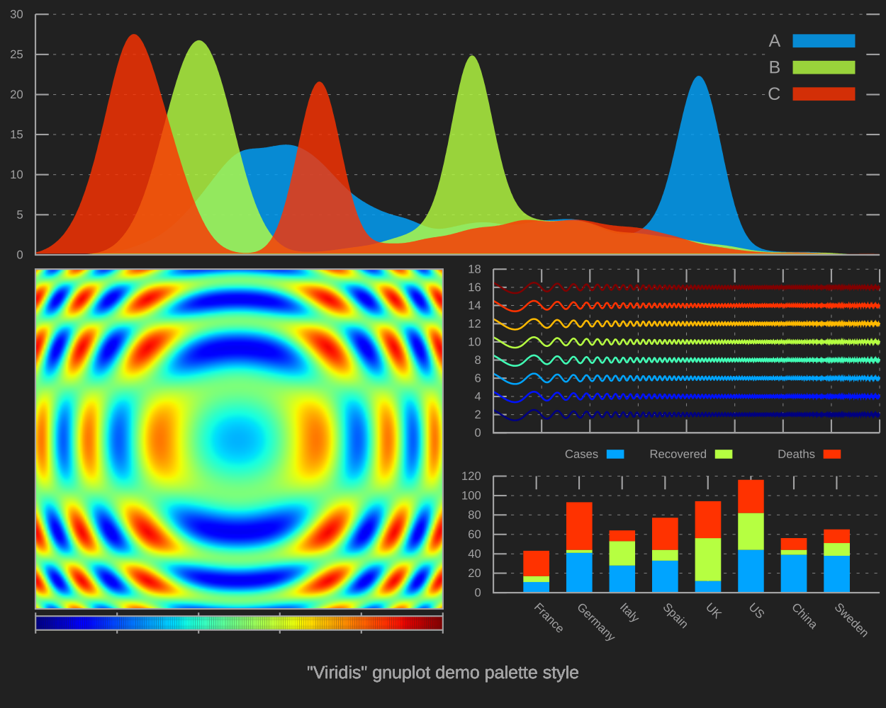
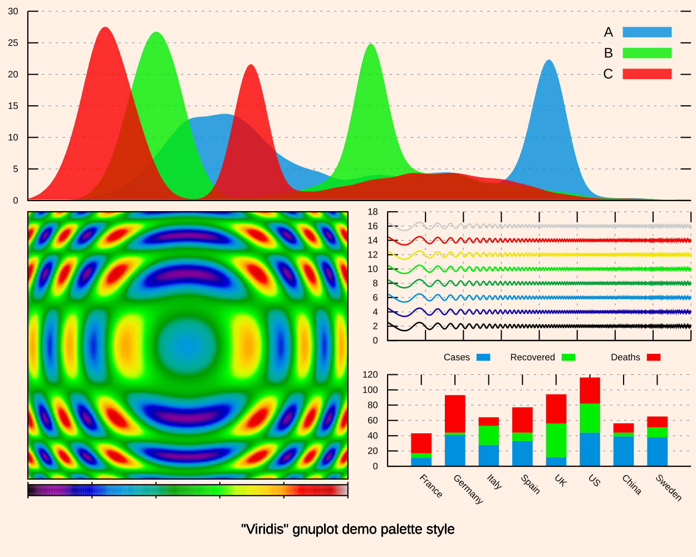
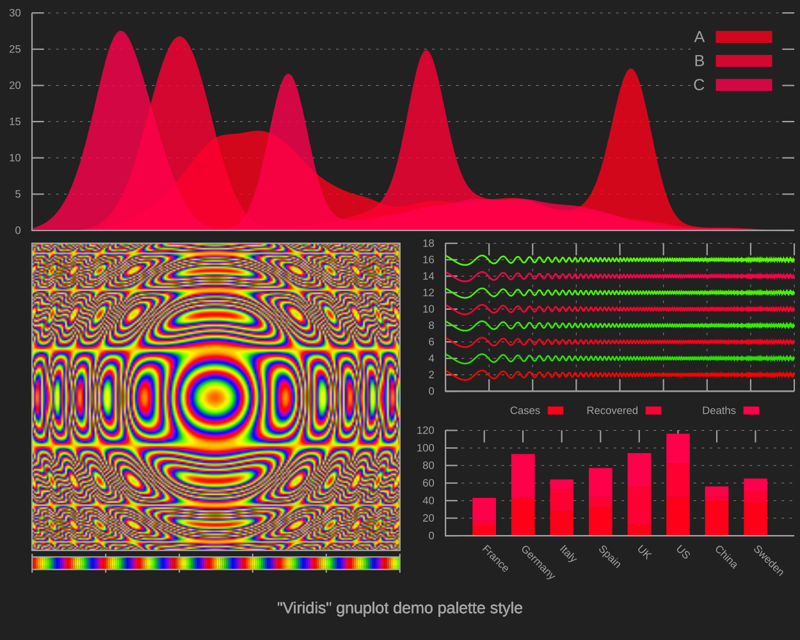
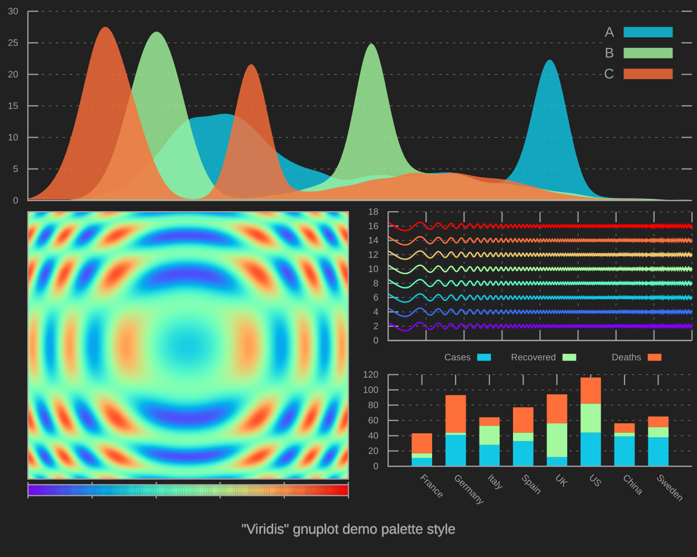
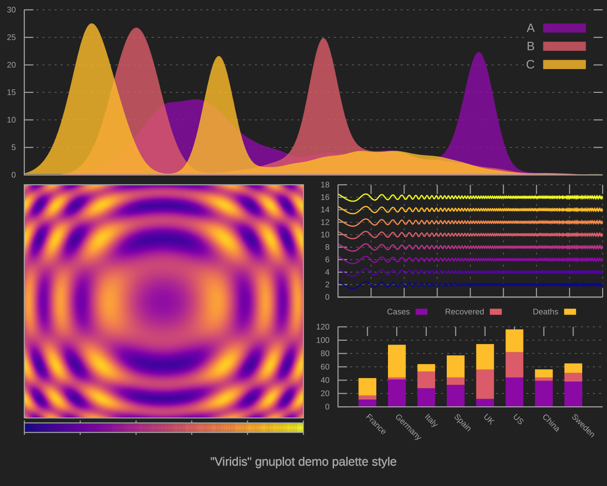
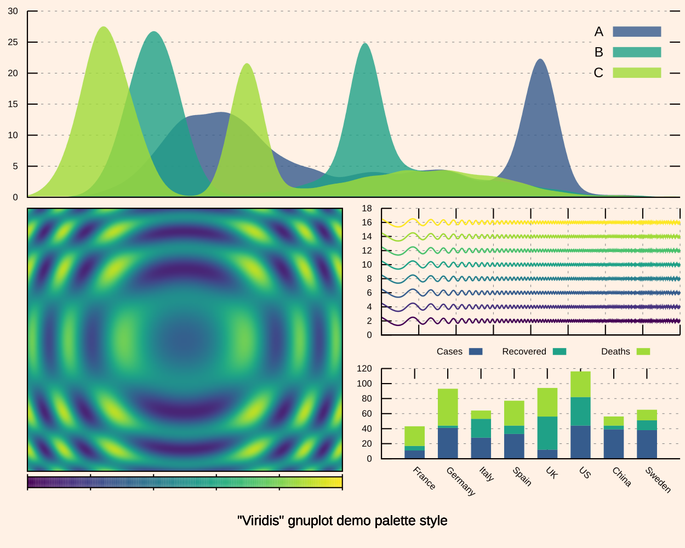
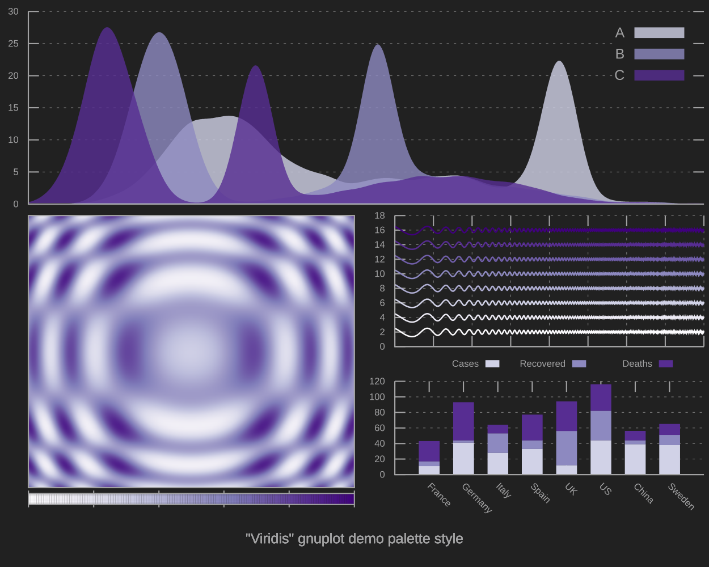
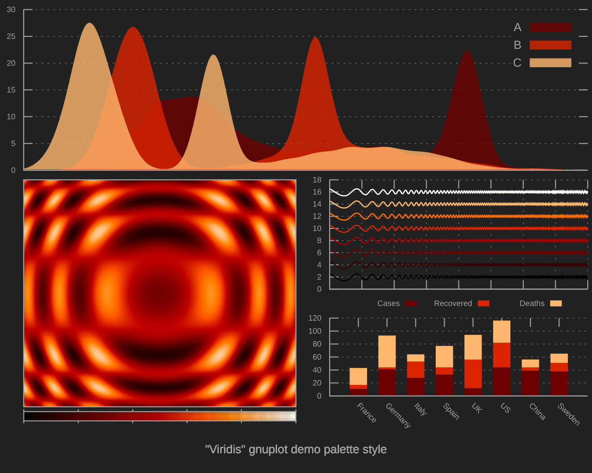
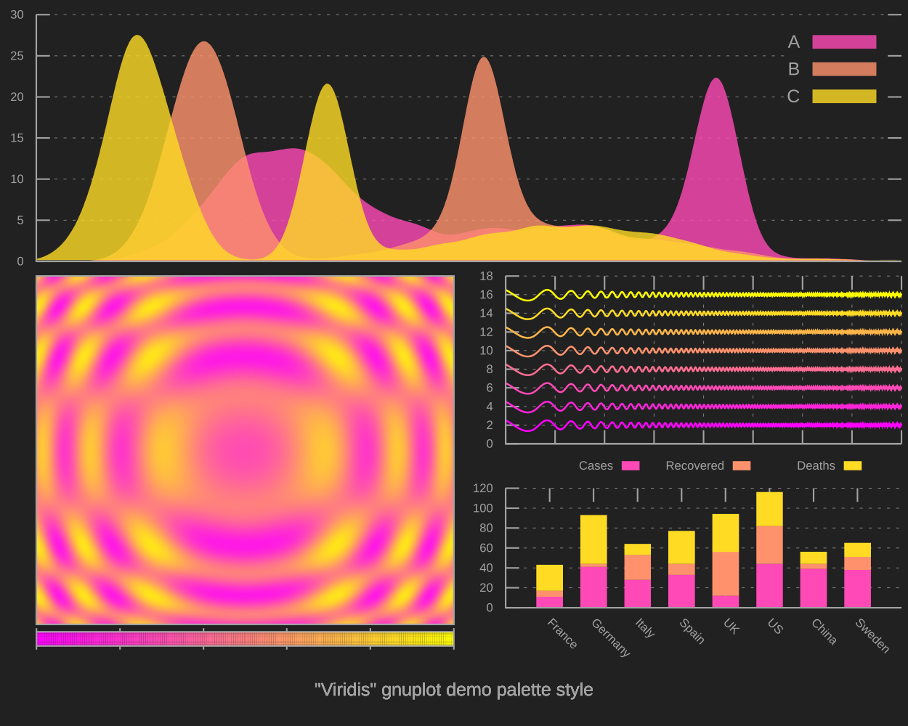
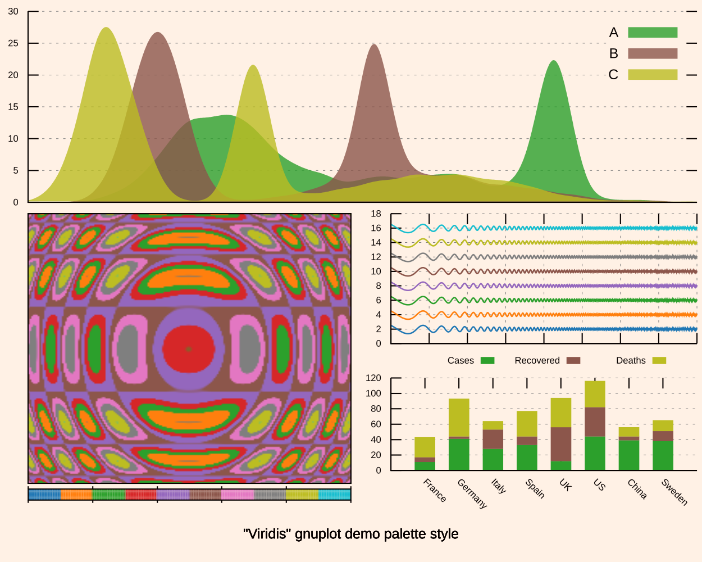

# Gnuplot-styles

Generate gnuplot styles and generate_palette

## Inspired

- https://matplotlib.org/3.1.1/tutorials/colors/colormaps.html

## Init environment

```
python -m venv .venv
source .venv/bin/activate
pip install -r requirements.txt
```

## Styles

This styles and palettes generated with `./generate_palette.sh`
### Palette
#### diverging
Name | bg_212121 | bg_FFF1E5
--- | --- | ---
BrBG |  | 
bwr |  | 
coolwarm |  | 
PiYG |  | 
PRGn |  | 
PuOr |  | 
RdBu |  | 
RdGy |  | 
RdYlBu |  | 
RdYlGn |  | 
seismic |  | 
Spectral |  | 
#### miscellaneous
Name | bg_212121 | bg_FFF1E5
--- | --- | ---
brg |  | 
CMRmap |  | 
cubehelix |  | 
flag |  | 
gist_earth |  | 
gist_ncar |  | 
gist_rainbow |  | 
gist_stern |  | 
gnuplot2 |  | 
gnuplot |  | 
jet |  | 
nipy_spectral |  | 
ocean |  | 
prism |  | 
rainbow |  | 
terrain |  | 
#### uniform
Name | bg_212121 | bg_FFF1E5
--- | --- | ---
cividis |  | 
inferno |  | 
magma |  | 
plasma |  | 
viridis |  | 
#### sequential
Name | bg_212121 | bg_FFF1E5
--- | --- | ---
Blues |  | 
BuGn |  | 
BuPu |  | 
GnBu |  | 
Greens |  | 
Greys |  | 
Oranges |  | 
OrRd |  | 
PuBuGn |  | 
PuBu |  | 
PuRd |  | 
Purples |  | 
RdPu |  | 
Reds |  | 
YlGnBu |  | 
YlGn |  | 
YlOrBr |  | 
YlOrRd |  | 
#### sequential2
Name | bg_212121 | bg_FFF1E5
--- | --- | ---
afmhot |  | 
autumn |  | 
binary |  | 
bone |  | 
cool |  | 
copper |  | 
gist_gray |  | 
gist_heat |  | 
gist_yarg |  | 
gray |  | 
hot |  | 
pink |  | 
spring |  | 
summer |  | 
winter |  | 
Wistia |  | 
#### qualitative
Name | bg_212121 | bg_FFF1E5
--- | --- | ---
Accent |  | 
Dark2 |  | 
Paired |  | 
Pastel1 |  | 
Pastel2 |  | 
Set1 |  | 
Set2 |  | 
Set3 |  | 
tab10 |  | 
tab20b |  | 
tab20c |  | 
tab20 |  | 
#### cyclic
Name | bg_212121 | bg_FFF1E5
--- | --- | ---
hsv |  | 
twilight |  | 
twilight_shifted |  | 
### Graphes
#### diverging
Name | bg_212121 | bg_FFF1E5
--- | --- | ---
BrBG |  | 
bwr |  | 
coolwarm |  | 
PiYG |  | 
PRGn |  | 
PuOr |  | 
RdBu |  | 
RdGy |  | 
RdYlBu |  | 
RdYlGn |  | 
seismic |  | 
Spectral |  | 
#### miscellaneous
Name | bg_212121 | bg_FFF1E5
--- | --- | ---
brg |  | 
CMRmap |  | 
cubehelix |  | 
flag |  | 
gist_earth |  | 
gist_ncar |  | 
gist_rainbow |  | 
gist_stern |  | 
gnuplot2 |  | 
gnuplot |  | 
jet |  | 
nipy_spectral |  | 
ocean |  | 
prism |  | 
rainbow |  | 
terrain |  | 
#### uniform
Name | bg_212121 | bg_FFF1E5
--- | --- | ---
cividis |  | 
inferno |  | 
magma |  | 
plasma |  | 
viridis |  | 
#### sequential
Name | bg_212121 | bg_FFF1E5
--- | --- | ---
Blues |  | 
BuGn |  | 
BuPu |  | 
GnBu |  | 
Greens |  | 
Greys |  | 
Oranges |  | 
OrRd |  | 
PuBuGn |  | 
PuBu |  | 
PuRd |  | 
Purples |  | 
RdPu |  | 
Reds |  | 
YlGnBu |  | 
YlGn |  | 
YlOrBr |  | 
YlOrRd |  | 
#### sequential2
Name | bg_212121 | bg_FFF1E5
--- | --- | ---
afmhot |  | 
autumn |  | 
binary |  | 
bone |  | 
cool |  | 
copper |  | 
gist_gray |  | 
gist_heat |  | 
gist_yarg |  | 
gray |  | 
hot |  | 
pink |  | 
spring |  | 
summer |  | 
winter |  | 
Wistia |  | 
#### qualitative
Name | bg_212121 | bg_FFF1E5
--- | --- | ---
Accent |  | 
Dark2 |  | 
Paired |  | 
Pastel1 |  | 
Pastel2 |  | 
Set1 |  | 
Set2 |  | 
Set3 |  | 
tab10 |  | 
tab20b |  | 
tab20c |  | 
tab20 |  | 
#### cyclic
Name | bg_212121 | bg_FFF1E5
--- | --- | ---
hsv |  | 
twilight |  | 
twilight_shifted |  | 
